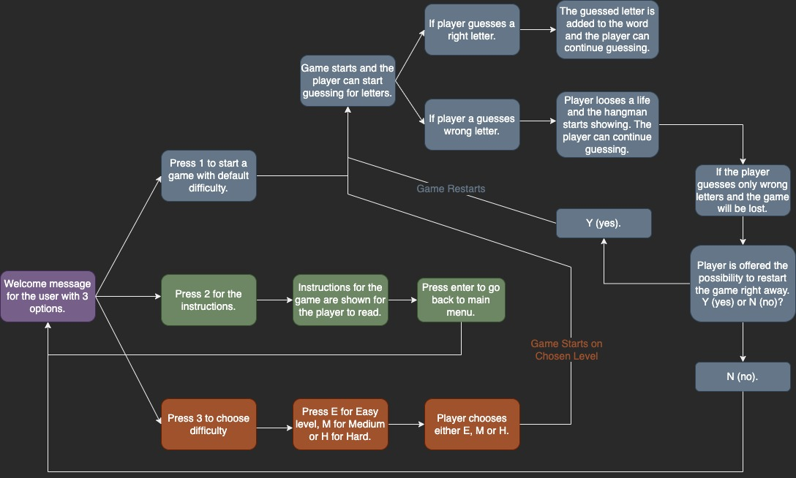

# Hangman

For my third milestone project I decided to create a game of Hangman. The theme for this Hangman game is European Countries, so the players task is to guess a letter and eventually find the hidden word. 
For every guess the player gets correct, a new letter will be revealed and eventually the player will hopefully see the word or be able to guess the whole word. 

The game is available to be played on three different levels: Easy (9 lives), Medium (6 lives) or Hard (4 lives).

Good luck & have fun!

&nbsp;

## Table of Contents
---
- [The Plan](#the-plan)

- [Features](#features)
    - [Start-up Page](#start-up-page)
    - [Instructions](#instructions)
    - [Choose Level](#choose-level)
    - [Choose Category](#choose-category)
    - [Player Win](#player-win)
    - [Player Lose](#player-lose)
    - [If Input is Number](#if-input-is-number)
    - [Too Many Letters](#too-many-letters)
    - [Guessed Letters](#guessed-letters)
    - [Future Improvements](#future-improvements)

- [Testing](#testing)

- [Technologies Used](#technologies-used)

- [Deployment & Local Development](#deployment)
    - [Deployment](#deployment)
    - [Local Development](#local-development)
        - [How to Fork](#how-to-fork)
        - [How to Clone](#how-to-clone)

- [Credits](#credits)
    - [Content](#content)
    - [Media](#media)
    - [Acknowledgements](#acknowledgements)

&nbsp;

## The Plan
---
This game was created for poeple of all ages that would like a fun game that is challenging with different difficulties. I wanted it to be an easy game to navigate through for both returning visitors as well as new ones. It should be clear for the player what options they have when the enter the game. 

&nbsp;
Before starting to build the game I made a plan of how I wanted it to work. To do this in a way that looked good and was easy to navigate I created a flowchart with the help of [diagrams.net](https://www.diagrams.net/).

&nbsp;

&nbsp;

## Features
---
### **Start-up page**
- This page is what the user sees when they enter the app. Here they are presented with three options: Start a default game, read instructions or choose what level they want to play.

&nbsp;

### **Instructions**
- If the player presses 2 at the start-up page, this is where they will be directed. Here they can read information about the game and some rules.

&nbsp;

### **Choose Level**
- If the player presses 3 at the start-up page, they will be directed to where they can choose level. Easy(9 lives), Medium(6 lives) or Hard(4 lives).

&nbsp;

### **Choose Category**
- When the player has chosen either to start a new game with the default difficulty or when they have chosen difficulty, they will be asked to choose a category in the next step. 

&nbsp;

### **Player Win**
- If the player succeeds to guess the correct country, they will be informed about guessing the right word and offered the opportunity to restart the game right away.
- Here the player will also know if they guess a right letter, even if the whole word is not found yet. 

&nbsp;

### **Player Lose**
- If the player does not succeed to guess the correct country, they will be informed about not having any more lives and that the game is over. Here they will also get the opportunity to restart the game right away.
- In this part of the game the player will also be informed if they have guessed a wrong number, and also know that they have lost a life. 

&nbsp;

### **If Input is Number**
- Since the game only accepts letters for guesses, if the player would guess anything else than a letter they will get the message below and will be asked to try again.

&nbsp;

### **Too Many Letters**
- The player is only able to guess one letter at a time and if they would guess more than that they will get the message below and be asked to try again. 

&nbsp;

### **Guessed Letters**
- The player will also be able to see the letters they've already guessed during the game.
- If the player would guess for a letter that has alrady been used, a message will be shown that the letter has already been used.

&nbsp;

&nbsp;

### **Future Improvements**
In the future I would like to improve the game by adding the following features:
- Some design would be great to make the game look more fun and appealing.
- For now, the player is only able to guess one letter at a time. I would like to make it possible for the player to guess the entire word(country) at once, if they know the full answer.
- I would also like to make some kind of scoreboard available through for example Google Sheets if possible, where players will be able to compete with friends.

&nbsp;

## Testing
---
### **PEP8 Validator**
Manual testing was performed throughout the project, testing each new element to find and squash any bugs. The full functionality has been tested, and I’ve tried breaking the application too by entering wrong data. All code has been validated online using the PEP8 Validator online: https://pep8ci.herokuapp.com/, and no errors are reported.

&nbsp;

### **Known Bugs**
None.

### **Encountered & Solved Bugs**
- A bug I encountered while building this game was when I would go to run the game and it just kept on giving me the same message over and over. I had to exit the terminal to stop it from running. 
    - The solution to this problem was an was an input statement that I had missed in my while loop, which made it run bad. 

&nbsp; 

## Technologies Used
---
- [HTML 5.2. - W3C Recommendation, 14 December 2017](https://html.spec.whatwg.org/multipage/)
    - The project uses HTML 5 to create the content.

- [CSS 3 CSS - Snapshot 2018 W3C Working Group Note, 22 January 2019](https://www.w3.org/TR/css-2018/)
    - The project uses CSS 3 to style the content and provide the layout.

- [Python](https://www.python.org/)
    - An interpreted, high-level, and general-purpose programming language.

- [Code Institute GitPod Full Template](https://github.com/Code-Institute-Org/gitpod-full-template)
    - Using the GitPod Full Template from the Code Institute for my project.

- [GitHub](https://github.com/)
    - Project repository.

&nbsp; 

## Deployment
---
- Heroku: The project was deployed to GitHub Pages using the following steps:
    - Log in to Heroku and go to your Apps. Select the app/project you wish to deploy.
    - Click on the "Deploy" section to view alternatives.
    - Inside the "Deploy" section, go to "Deployment method".
    - Connect your GitHub account to your Heroku project.
    - Choose the project you wish to deploy in the "App connected to GitHub" section below.
    - Enable Automatic deploys.

The live deployment can be found here: [Hangman](https://milestone3-hangman.herokuapp.com/)

### **Local Development**

#### How to Fork
- To fork my repository:

    Login (or sign up) to GitHub.
    Go to the repository for this project here
    Click the Fork button in the top right corner.

#### How to Clone
- If you wish to clone my project, please see the following steps below:

    Navigate to GitHub: https://github.com/emeliehansson/milestone-3-hangman Select the 'Clone' button Copy the URL or download it as a ZIP file Use git clone + the URL in your terminal, or unpack the ZIP containing the project.

&nbsp; 

## Credits
---
### **Content**
For this project I have used a few other students projects as a help to understanding how to structure and write my code.
- [TaraHelberg](https://github.com/TaraHelberg/Hang-Hangman)
- [gibbo101](https://github.com/gibbo101/hangman)
- [nicolemne](https://github.com/nicolemne/project-portfolio-3)

I have also watched a video that helped me understand how to start this project:
- [How to build HANGMAN with Python in 10 MINUTES](https://www.youtube.com/watch?v=m4nEnsavl6w)

### **Media**
- [Cool Symbol](https://coolsymbol.com/) has been used for the symbols and emojis used in the game.
- [Fsymbols](https://fsymbols.com/generators/carty/) was used to style the title "Are you ready to play Hangman?!". 
- The imagery for the Hangman that shows when the player makes a wrong guess was borrowed from [gibbo101](https://github.com/gibbo101/hangman).
- The flowchart was made with [diagrams.net](https://www.diagrams.net/).