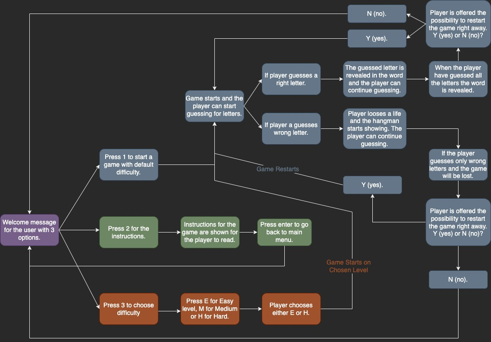

# Hangman

For my third milestone project I decided to create a game of Hangman. The theme for this Hangman game is European Countries, so the players task is to guess a letter and eventually find the hidden word. 
For every guess the player gets correct, a new letter will be revealed and eventually the player will hopefully see the word or be able to guess the whole word. 

The game is available to be played on three different levels: Easy (9 lives), Medium (6 lives) or Hard (4 lives).

Good luck & have fun!

&nbsp;

## Table of Contents
---

&nbsp;

## The Plan
---

Before starting to build the game I made a plan of how I wanted it to work. To do this in a way that looked good and was easy to navigate I created a flowchart with the help of [diagrams.net](https://www.diagrams.net/).

&nbsp;

## Features
---
### Start-up page
- This page is what the user sees when they enter the app. Here they are presented with three options: Start a default game, read instructions or choose what level they want to play.

&nbsp;

### Instructions
- If the player presses 2 at the start-up page, this is where they will be directed. Here they can read information about the game and some rules.

&nbsp;

### Choose Level
- If the player presses 3 at the start-up page, they will be directed to where they can choose level. Easy(9 lives), Medium(6 lives) or Hard(4 lives).

&nbsp;

### Player Win
- If the player succeeds to guess the correct country, they will be informed about guessing the right word and offered the opportunity to restart the game right away.

&nbsp;

### Player Lose
- If the player does not succeed to guess the correct country, they will be informed about not having any more lives and that the game is over. Here they will also get the opportunity to restart the game right away.

&nbsp;

### If Input is Number
- Since the game only accepts letters for guesses, if the player would guess anything else than a letter they will get the message below and will be asked to try again.

&nbsp;

### Too Many Letters
- The player is only able to guess one letter at a time and if they would guess more than that they will get the message below and be asked to try again. 

&nbsp;